# Loom UI Reference

_Generated 2/27/2026 from smoke test screenshots._

## Analytics

### Admin analytics charts

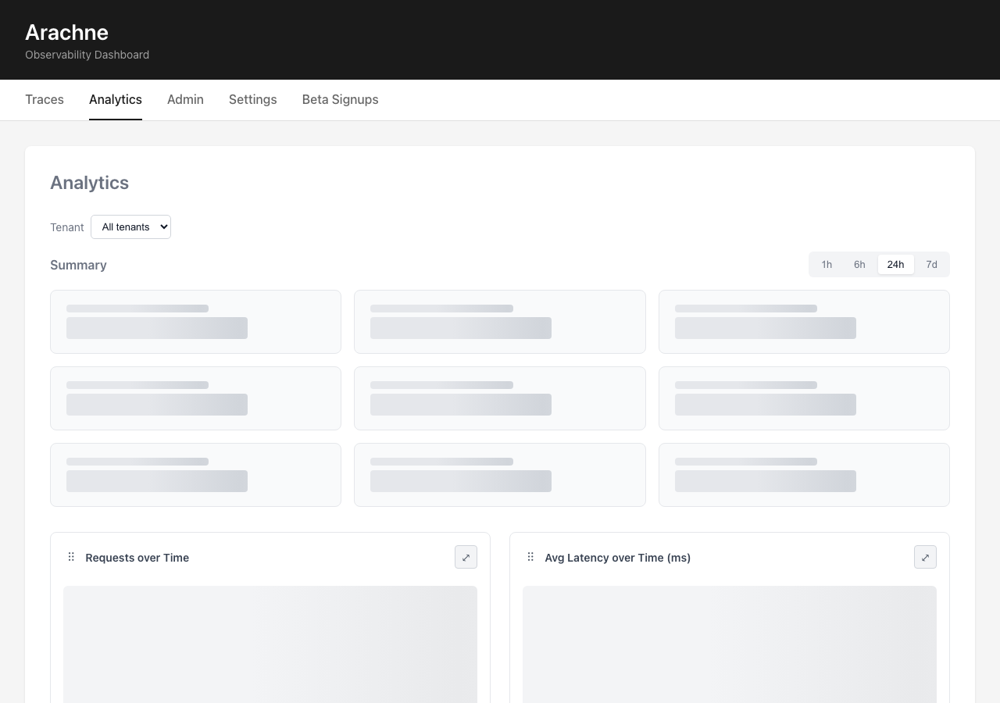

### Portal analytics page

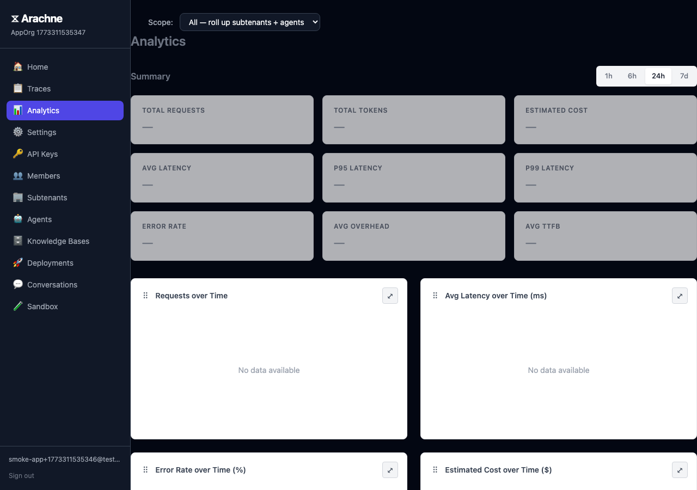

## Authentication

### Admin dashboard after login

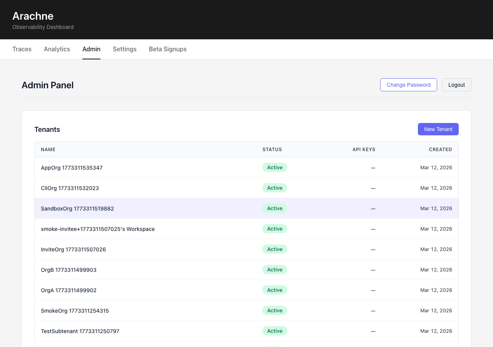

### Portal after invite acceptance

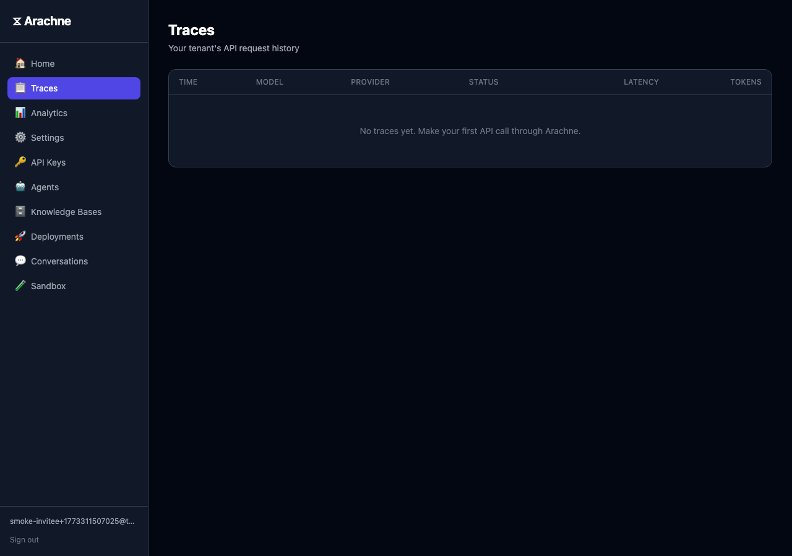

### Portal after login

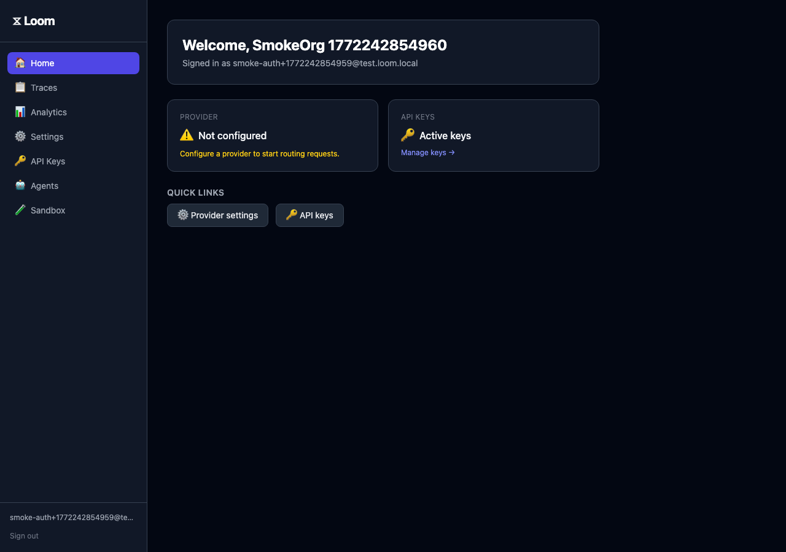

### Portal after signup

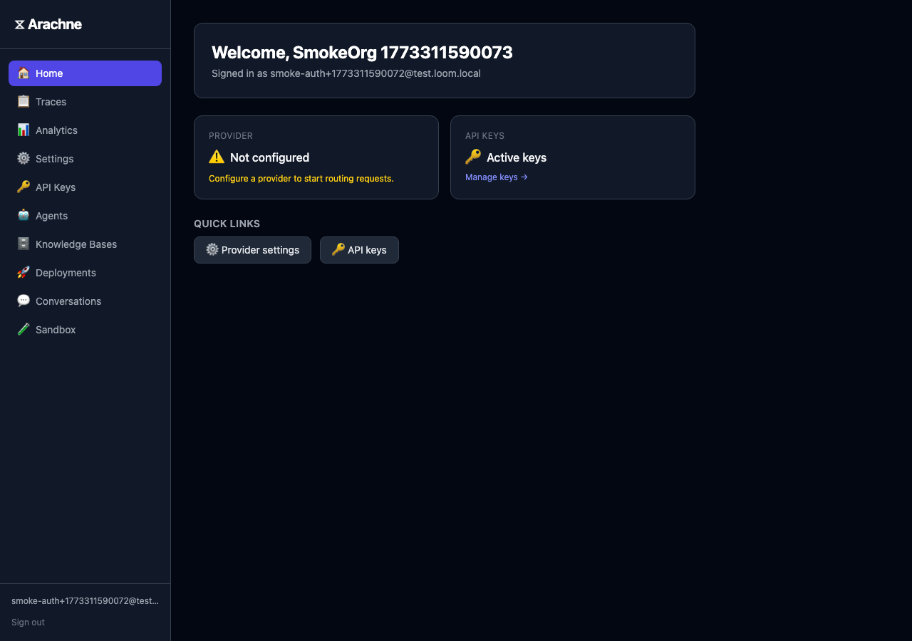

## Traces

### Admin traces list

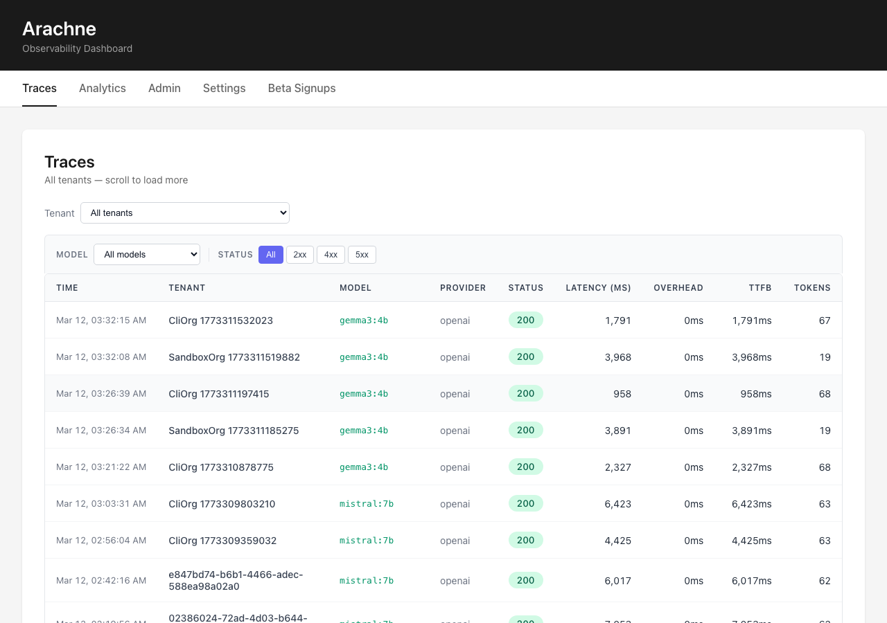

### Portal traces page

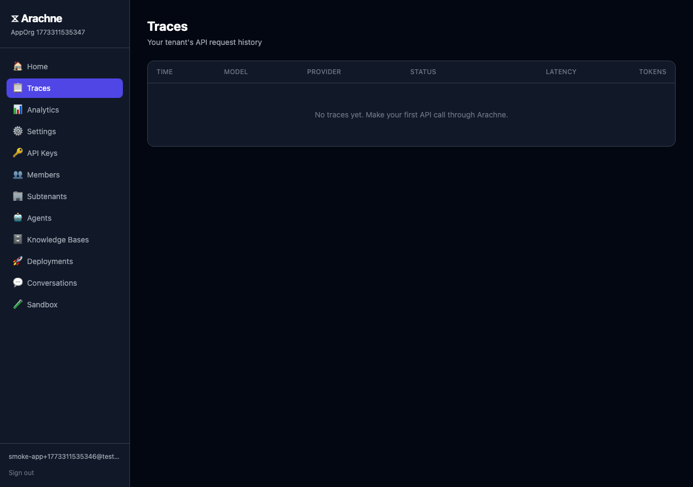

## Agents

### Agent created in list

### Agent editor form

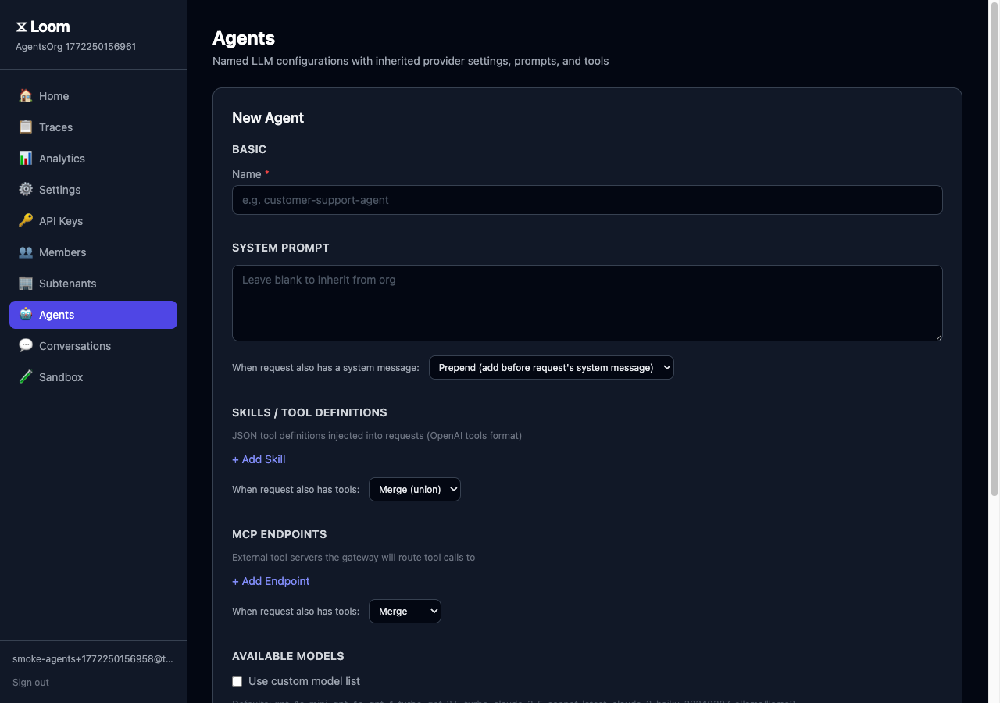

### Portal agents page

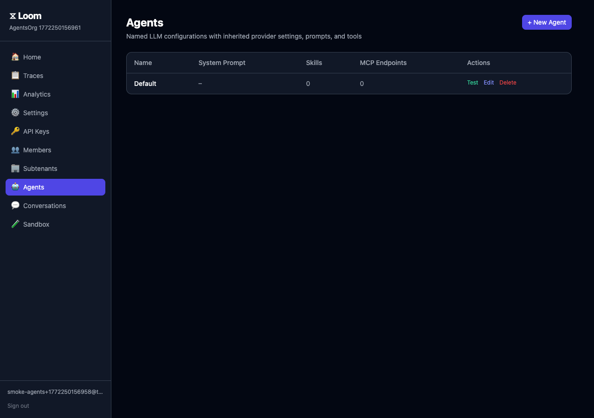

## API Keys

### Portal API keys page

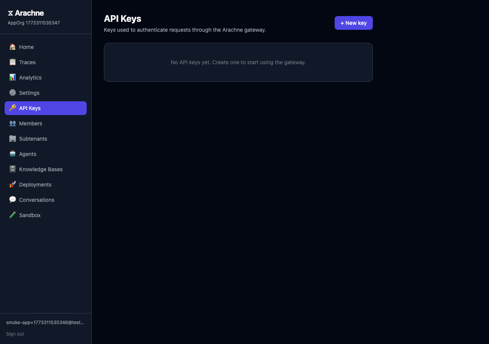

## Members

### Members page invite section

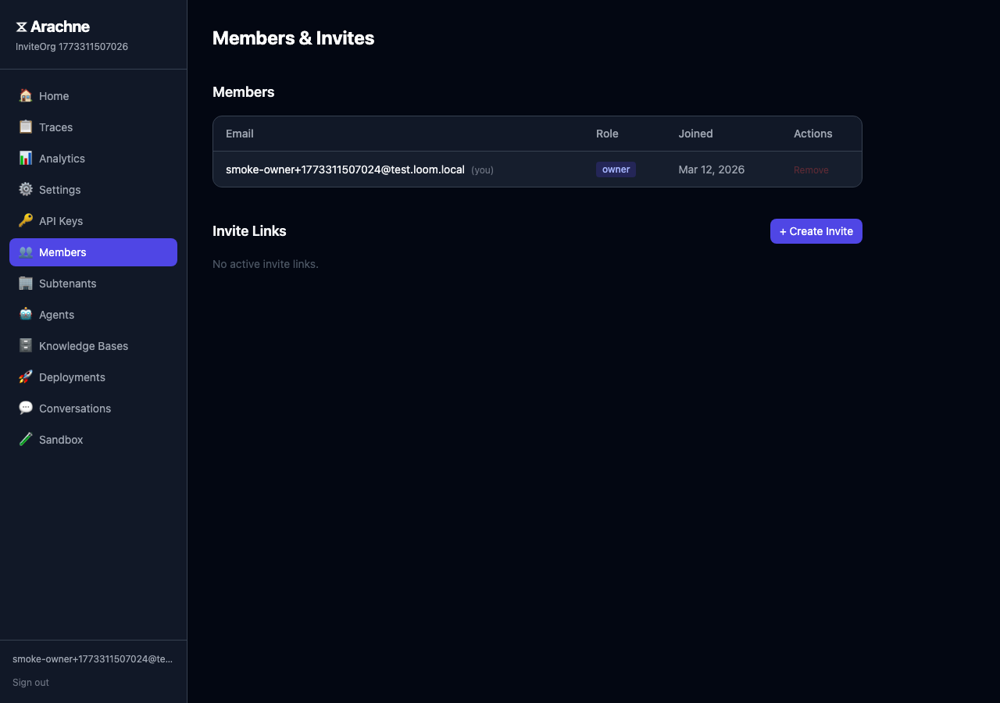

### Portal members page

## Settings

### Portal settings page

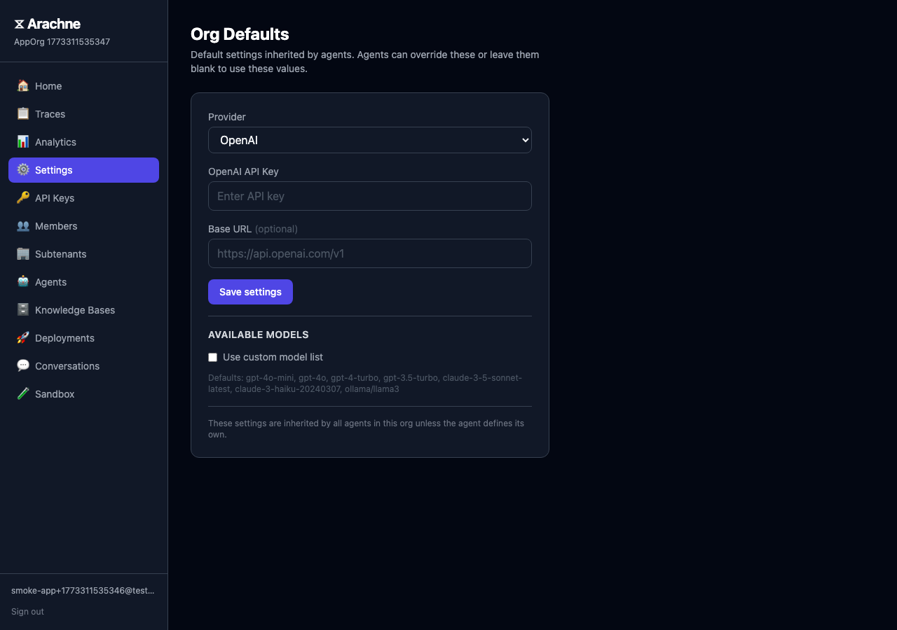
